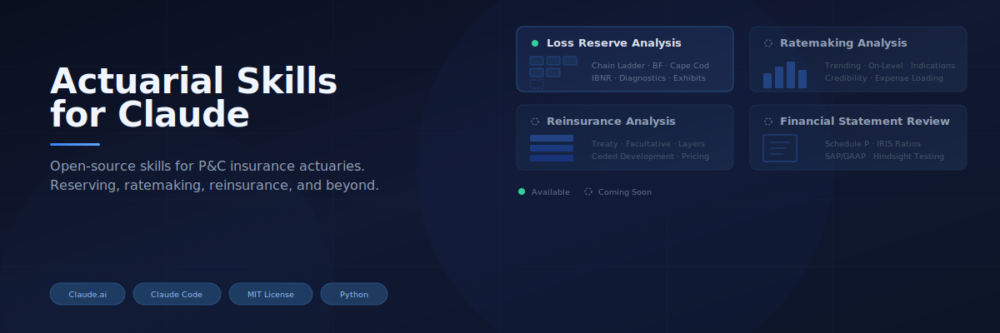

  

  

<h1 align="center">Actuarial Skills for Claude</h1>

<strong>Claude skills for property & casualty reserving and reinsurance work — adapted for European practice.</strong>

  <a href="#available-skills">Skills</a> •
  <a href="#quick-start">Quick Start</a> •
  <a href="#example-usage">Example</a> •
  <a href="#roadmap">Roadmap</a> •
  <a href="#credits">Credits</a>

 

This repository collects ready-to-use Claude skills for P&C actuarial work. It builds on the open-source [`kalta-ai/actuarial-skills`](https://github.com/kalta-ai/actuarial-skills) project (MIT licensed) and is being adapted for European practice — Solvency II reserve reporting, SAV exam-relevant methods, and treaty reinsurance contexts. The intent is to make standard actuarial workflows directly executable in a Claude Project, while keeping the methods transparent and auditable.

---

## What Are Skills?

Skills are packaged workflows that extend Claude's capabilities for domain-specific tasks. When you install a skill into a Claude Project, Claude recognizes when to use it — upload a loss triangle and ask "check my reserves," and Claude runs a full analysis using standard methods without any code on your side.

Skills work in [Claude.ai](https://claude.ai) Projects and [Claude Code](https://docs.claude.com/en/docs/claude-code).

## Available Skills

### Loss Reserve Analysis

Upload a loss development triangle or claim-level transaction data (Excel or CSV) and get a multi-method reserve analysis with formatted exhibits.

**Methods:**
- Chain Ladder — volume-weighted and simple-average age-to-age factors
- Bornhuetter-Ferguson — blends a priori ELR with development pattern
- Cape Cod (Stanard-Bühlmann) — derives ELR directly from the data
- Tail factor estimation via exponential decay

References include Friedland's *Estimating Unpaid Claims Using Basic Techniques* and standard ASOPs (43, 23, 25, 36) for educational context. Planned extensions cover Mack (1993), Wüthrich & Merz, and Solvency-II-relevant reporting (see Roadmap).

**Output:** A 6-exhibit Excel workbook:

| Exhibit | Contents |
|---------|----------|
| 1 — Triangle | Input data, formatted |
| 2 — ATA Factors | Individual and selected age-to-age factors |
| 3 — CL Ultimates | Chain ladder ultimates, CDFs, IBNR by accident period |
| 4 — BF & Cape Cod | BF and Cape Cod results (when premium is provided) |
| 5 — Diagnostics | Calendar year test, outlier detection, tail sensitivity |
| 6 — Summary | Side-by-side method comparison with range analysis |

**Diagnostics flag:** outlier age-to-age factors (>2σ from the column mean), calendar year diagonal inconsistencies, negative development, and total IBNR sensitivity to ±10% and ±25% tail factor changes.

---

## Quick Start

### Option 1: Install the `.skill` File

1. Download `loss-reserve-analysis.skill` from the [Releases](../../releases) page
2. In a Claude.ai Project: Project Settings → Skills → Upload skill
3. Upload any loss triangle and ask Claude to analyze it

### Option 2: Add Manually to a Project

1. Clone this repo
2. In your Claude.ai Project, add the contents of `loss-reserve-analysis/` to Project Knowledge
3. Claude will reference the skill when you upload triangles

## Example Usage

Upload a triangle like this:

| Accident Year | 12 | 24 | 36 | 48 | 60 |
|---------------|------|------|------|------|------|
| 2019 | 1,610 | 2,450 | 2,810 | 2,990 | 3,070 |
| 2020 | 1,390 | 2,080 | 2,390 | 2,540 | — |
| 2021 | 1,550 | 2,340 | 2,680 | — | — |
| 2022 | 1,820 | 2,750 | — | — | — |
| 2023 | 2,100 | — | — | — | — |

Then ask:

> "Run a loss reserve analysis on this triangle. Incurred losses in thousands, development in months."

Or, with premium data:

> "Check reserves on the attached triangle. Earned premiums are in the second sheet. Use BF and Cape Cod too."

Claude parses the triangle, runs the applicable methods, and returns a formatted Excel report with a narrative summary.

---

## Supported Input Formats

- **Standard triangle** — rows are accident periods, columns are development periods
- **Columnar / long format** — three columns: accident period, development period, loss amount
- **Transaction-level data** — raw claim records with `claim_id`, `accident_date`, `evaluation_date`, and loss columns; aggregated automatically
- **Excel or CSV** — `.xlsx`, `.xls`, `.xlsm`, `.csv`
- **Multiple sheets** — specify which sheet contains the triangle; premium can be on a separate sheet

Development periods can be in months or years. Accident periods can be annual or quarterly.

## Important Caveats

This is a **quick check**, not a full reserve study:

- Methods are standard textbook implementations — they don't incorporate claim-level information, operational context, or judgment that a credentialed actuary would apply
- Tail factor selection is mechanical (exponential decay). Production reserving requires judgment on tail selection
- Results should be cross-referenced with knowledge of changes in claims handling, coverage, legal environment, or reinsurance structure
- **This does not constitute an actuarial opinion under ASOP No. 43, a Statement of Actuarial Opinion under ASOP No. 36, or a SAV-compliant report under Swiss professional standards**
- ASOPs are referenced for educational context only — they are not compliance guidance

Use this as a starting point or sanity check, not as a substitute for a signed actuarial analysis.

---

## Roadmap

Adaptations and extensions planned for this fork:

| Item | Status | Description |
|------|--------|-------------|
| Mack (1993) variance estimate | Planned | Analytical reserve standard error to support distributional reporting and SCR-relevant outputs |
| Bootstrap chain ladder | Planned | Empirical distribution of ultimates for use in capital and risk-margin contexts |
| Berquist-Sherman | Planned | Adjustment for case reserve adequacy shifts and changes in payment patterns |
| Solvency II / FINMA reporting hooks | Planned | Output formats aligned with QRT S.19.01 and Swiss reserve reporting templates |
| Wüthrich & Merz reference layer | Planned | Replace US-only references with European stochastic reserving literature |
| Treaty reinsurance reserving | Planned | Net-vs-gross development, layered triangles, ceded reserve analysis |

Issues and pull requests welcome.

---

## Contributing

Contributions are welcome — particularly from European P&C and reinsurance practitioners. Bug reports on triangle parsing, suggestions for additional methods, and improvements to diagnostics are all useful. See [CONTRIBUTING.md](CONTRIBUTING.md) for guidelines.

## License

MIT License. See [LICENSE](LICENSE) for details.

## Credits

This project is based on [`kalta-ai/actuarial-skills`](https://github.com/kalta-ai/actuarial-skills), originally created by Kohei Kudo and [Kalta](https://kalta.ai), used here under the MIT License. Adaptations for European actuarial practice and reinsurance contexts by [Ilker Aslan](https://github.com/ilkeraslan).
